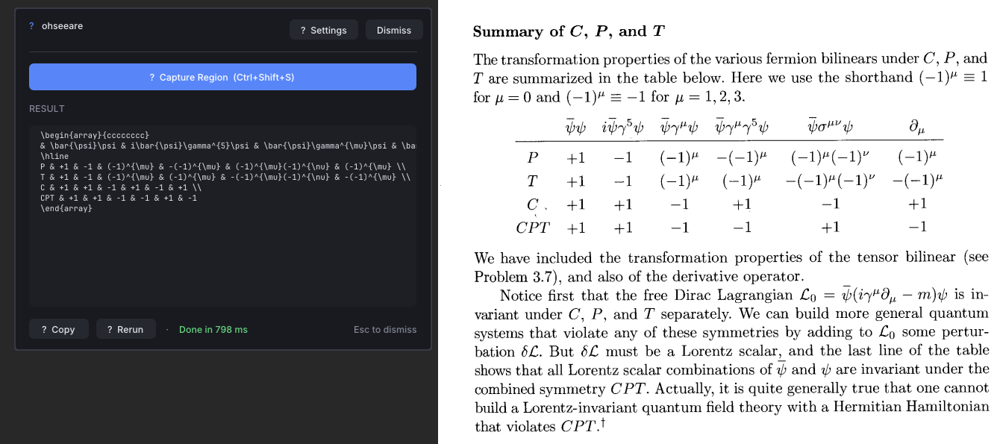
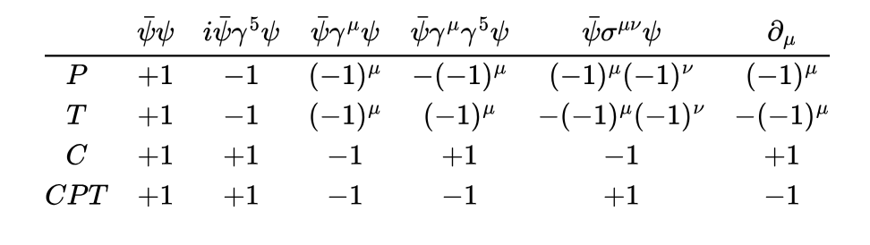

# ohseeare

Screen-region OCR via [llama.cpp](https://github.com/ggml-org/llama.cpp). 
I got sick of typing out LaTeX snippets and tables so I made this small tool. It has a lot of problems but 
gets the job done. Use GLM-OCR for best results.

It's worth noting that there are several other tools out there that do 
basically the same thing, and those tools are far more mature and polished.

## Example output
This is an excerpt from a table in An Introduction to Quantum Field Theory by Michael E. Peskin, Daniel. V. Schroeder. 
With the tool running on the left hand side of the image.


The resulting LaTeX code:
```latex
\begin{array}{cccccccc}
& \bar{\psi}\psi & i\bar{\psi}\gamma^{5}\psi & \bar{\psi}\gamma^{\mu}\psi & \bar{\psi}\gamma^{\mu}\gamma^{5}\psi & \bar{\psi}\sigma^{\mu\nu}\psi & \partial_{\mu} \\
\hline
P & +1 & -1 & (-1)^{\mu} & -(-1)^{\mu} & (-1)^{\mu}(-1)^{\nu} & (-1)^{\mu} \\
T & +1 & -1 & (-1)^{\mu} & (-1)^{\mu} & -(-1)^{\mu}(-1)^{\nu} & -(-1)^{\mu} \\
C & +1 & +1 & -1 & +1 & -1 & +1 \\
CPT & +1 & +1 & -1 & -1 & +1 & -1
\end{array}
```

Which renders as:





## Dependencies

All included:
- [llama.cpp](https://github.com/ggml-org/llama.cpp)
- [tinyfiledialogs](https://sourceforge.net/projects/tinyfiledialogs/)
- [ImGui](https://github.com/ocornut/imgui)
- [GLFW](https://www.glfw.org/) And [GLAD](https://glad.dav1d.de/)

OS-specific:
- X11 dev headers - Debian/Ubuntu (Linux only)
- WIN32 API - Windows only.
- No Apple support yet.

GLFW and llama.cpp are included as git submodules.
Use `git submodule update --init` to pull these.

Models are not included in the repo. However, you can run `./install.sh` to pull a GLM-OCR gguf
model from Hugging Face, or you can download them yourself. Note that the models
are explicitly split into two files: the model and the projection matrix, and this is
reflected when loading the model. i.e. You must specify both the model and the projection matrix paths, 
and they must be compatible with each other.

## Building

```sh
cmake -B build // Optionally disable CUDA with '-DGGML_USE_CUDA=OFF'
cmake --build build
```

Custom model paths: `-DOHSEEARE_MODEL_PATH=...` and `-DOHSEEARE_MMPROJ_PATH=...`.
By default these should point to models/ Note that you can either download models yourself or run
the install script to pull them from Hugging Face via wget.

Press `Ctrl+Shift+S` (or click **Capture Region**), drag to select, then copy the result. Use **Rerun** to re-OCR the same capture with different settings.

## Usage

- Soon

## License

MIT — see [LICENSE](LICENSE).

Bundled: [tinyfiledialogs](https://sourceforge.net/projects/tinyfiledialogs/) (Zlib), [ImGui](https://github.com/ocornut/imgui) (MIT), [GLAD](https://glad.dav1d.de/) (MIT).
